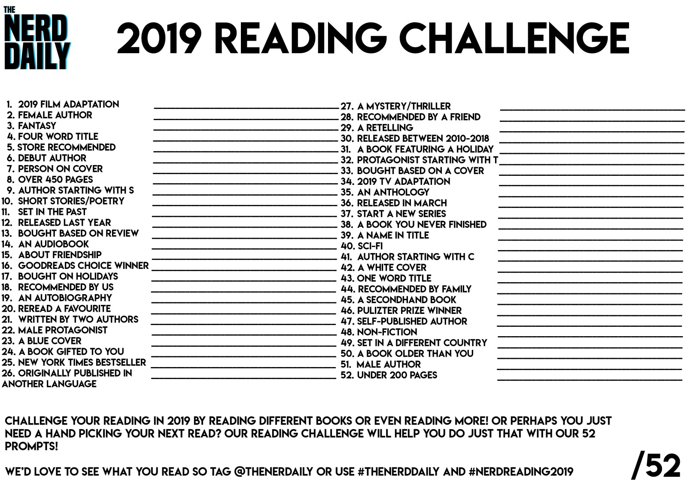

In 2018, I found myself have more time to read again, In 2019, I want to challenge myself a little bit. I want to commit reading 52 books this year or 1 book each week.  In the last 2 years, I always want to finish the reading challenge of that year, however, I never did. 2017 I read 1 or 2 books out or 10 books I challenged myself. Last year I finished 4 out of 5 (not so bad). This year I want to push myself to a new level by putting a target to finish 52 books, the book selection will loosly based on this check list:

Every time I finish a book, I will write a review and update this post and answer these 3 questions in the reviews:
1. Why I choose that book?
2. What did I learn/gain after reading the book?
3. Was it worth my time?

Since 2019 will start on Tuesday, I will start the challenge on December 31st, 2018, which is today. Stay tuned for updates and Happy New Year to you all!