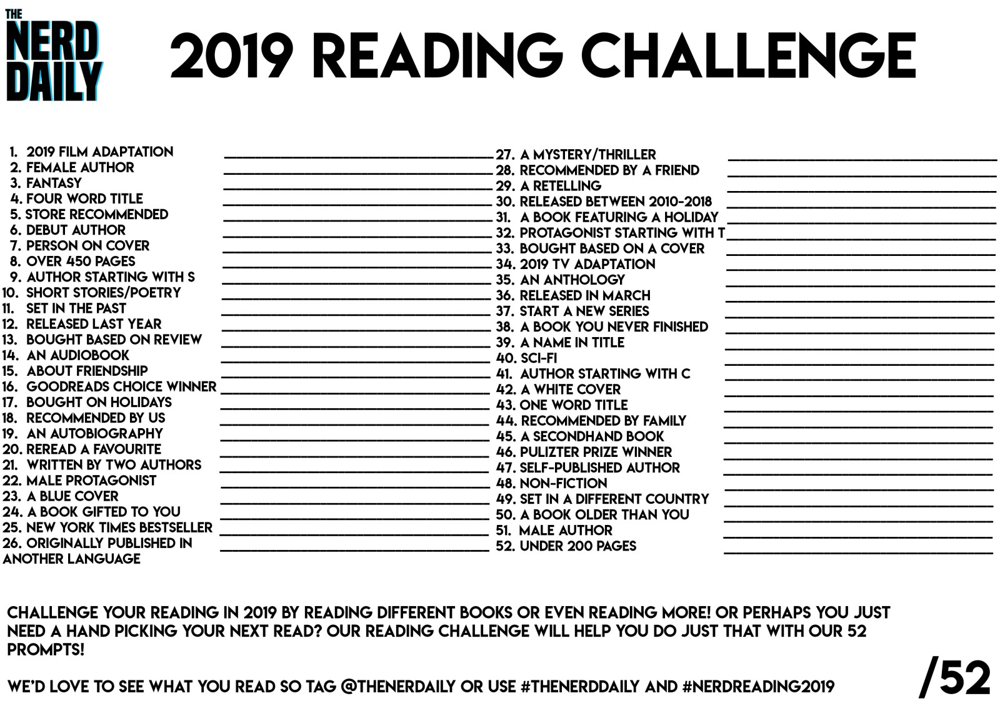

In 2018, I found myself have more time to read again, In 2019, I want to challenge myself a little bit. I want to commit reading 52 books this year or 1 book each week.  In the last 2 years, I always want to finish the reading challenge of that year, however, I never did. 2017 I read 1 or 2 books out or 10 books I challenged myself. Last year I finished 4 out of 5 (not so bad). This year I want to push myself to a new level by putting a target to finish 52 books.

