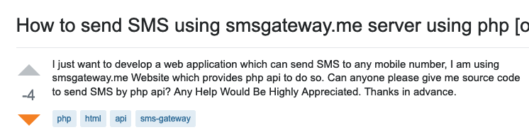
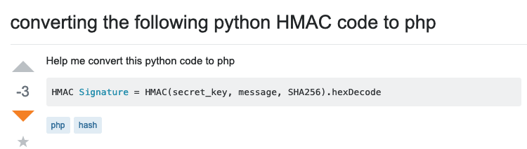
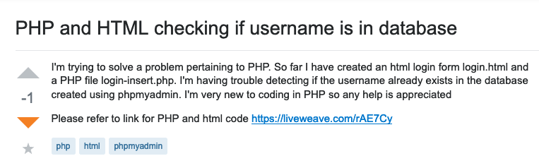
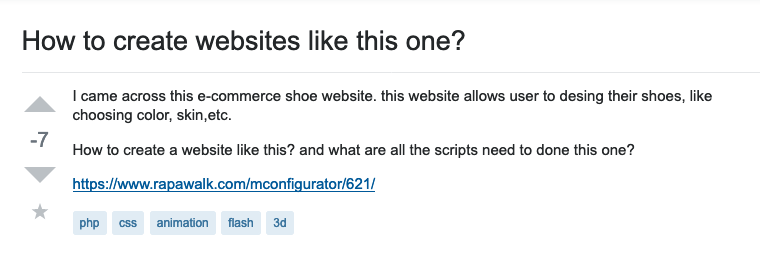
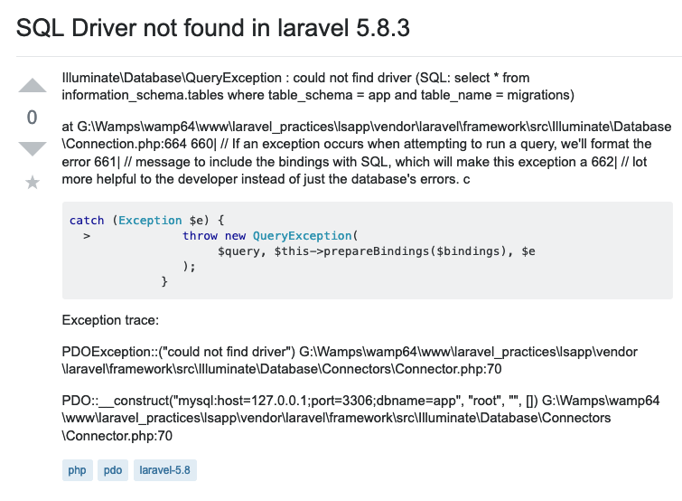

Recently I start extensively build up my knowledge, I reckon one of the best thing to learn is to teach other fellow developers. I started answering question on stackoverflow.com. 

##Didn't research before posting a question

This type of question is pretty common on SO, some people just simply asking for help before they do any research or rely on other to do that for them. SO is a very big community, most of the common issue that developers face, it is likely that there is a question and answer for that. It would save posters a lot of time if they just simply Google that issue first.

##SO is not a free coding service

SO is a coding community and people would always love to help others, however, some user believe that they can just ask other to do the coding for them.

##No code sample/Post image of code instead of text

##Vague description

##No format

