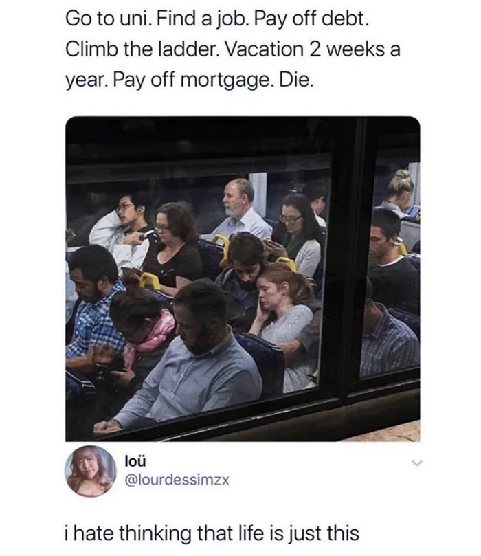

Cách đây vài hôm, mình đọc được một đoạn tweet được share online như sau

Cảm giác của mình vừa tức giận vừa cảm thông
Tức giận bởi vì không hiểu tại sao nhiều người lại có cái nhìn bi quan như vậy, 
những thứ họ liệt kê ra, đối với đa phần mọi người, được coi là những thứ chán chường, gánh nặng, trói buộc họ vào những bon chen đời thường
một nửa trong số đó, họ tự làm cho chính bản thân của họ, không một ai ép buộc
Đi học đại học => đại học không phải là con đường duy nhất để có được một công việc
Leo lên bậc thang => một khi làm vì đam mê, không phải vì đồng tiền thì cấp bậc nó không còn là mục tiêu nữa, và người khác sẽ tự giao cấp bậc cho bạn nếu bạn xứng đáng.
Cảm thông bởi vì họ phải trải qua những cảm xúc tiêu cực như vậy, họ không biết tại sao họ lại rơi vào hoàn cảnh như vậy và họ cũng không biết cách nào để thoát ra khỏi nó.
Cuộc sống là như vậy, đầy những thăng trầm
Mình có thể gọi là may mắn khi xác định mình muốn làm gì từ rất sớm
Từ lúc 